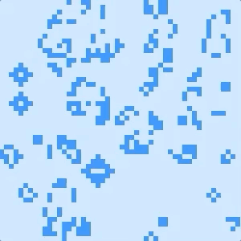
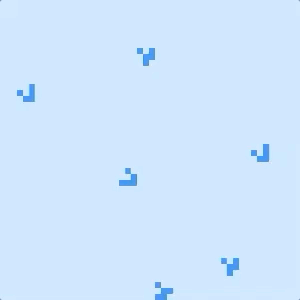
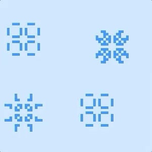
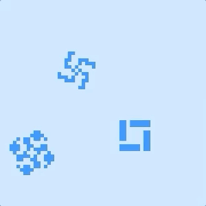

# Conway's Game of Life
See it live: [rcummins.com/conway/](https://rcummins.com/conway/?utm_source=github&utm_medium=readme&utm_campaign=github)

## Tech inventory

* HTML5 Canvas API for drawing
* JavaScript OOP

## Description

My implementation of Conway's Game of Life uses a 2-dimensional grid of square cells. Every cell in the grid has two possible states, alive or dead. Each cell lives, dies or is reborn in the next generation depending on how many of its neighbors are alive.

The control panel allows users to:
* Change the size of the grid cells
* Change the speed at which the game runs
* Select a pattern with which to initialize the game
* Pause the game
* Change the color scheme of the grid

While the game is paused, users can click on the grid to change any cell's state from living to dead or vice versa.

## Optimization

During development, I noticed that the animation was lagging when set to the smallest cell size and the fastest speed. I used the Performance panel in Chrome DevTools to identify the repeated calls to the fillRect() method of the Canvas API as the bottleneck. At small cell sizes, the grid contains many cells, and drawing an individual square to represent every cell was slow.

I decreased the rendering lag by 90% by drawing a single background rectangle covering the whole canvas to represent all dead cells, and then drawing individual squares to represent only the living cells on top of the background rectangle. This greatly reduced the number of calls to the fillRect() method of the Canvas API, because the rules of Conway's Game of Life ensure that only a minority of the cells in the grid will be living after the first generation.

## Seed patterns

Users can choose to initialize the game with one of four seed patterns:

#### Random

Each cell is randomly selected to be initialized as living or dead, with a 20% chance that any given cell will be initialized as living. This causes the game to be mostly chaotic, although some organized patterns do spontaneously emerge by chance.



#### Gliders

Gliders are classified as spaceship type patterns because they translate themselves across the grid. Gliders consist of five living cells that can be initialized in four different configurations.



#### Pulsars

Pulsars are classified as oscillator type patterns because they return to their initial state every n generations. Pulsars have a period of 3 generations.



#### Kok's galaxies

Kok's galaxies are my favorite pattern! They are also classified as oscillator type patterns, with a period of 8 generations. This pattern was discovered by Jan Kok in 1971.



### Random placement of patterns

When the game is initialized with gliders, pulsars or Kok's galaxies, I want these patterns to appear to be irregularly scattered throughout the canvas. However, I also want to ensure that each pattern is always surrounded by a border of dead cells, to prevent the pattern from interfering with the evolution of any other pattern.

I met these requirements by dividing the grid into a set of rectangular subsections such that each rectangle is big enough to fit the pattern inside it with some space left over. Then I loop over all rectangles until at least one pattern has been placed on the canvas. For each rectangle, there is a chance that a pattern will or will not be placed in that rectangle, so that the typical game will have some blank areas of the canvas. If a pattern will be placed in a rectangle, I choose a random location within the rectangle to initialize the pattern, so that patterns are not aligned into rows or columns on the canvas.

Another irregular element is introduced by randomly choosing among the evolutionary states of a pattern each time a pattern is initialized. Pulsars have a period of 3 generations, meaning that a pulsar oscillates between 3 different evolutionary states. Each pulsar is initialized in a state that is randomly chosen from among those 3 states, making it unlikely that all the pulsars on the canvas will be oscillating synchronously.

The following code is executed inside a nested loop over all of the rectangles:

```JavaScript
// src/seed_utility.js

// randomly choose whether or not to place a pattern in this rectangle
if (Math.random() < occurrenceFrequency) {
  // canvas is no longer empty, so we can stop the outermost loop
  canvasEmpty = false;

  // randomly shift pattern within rectangle
  rowShift = Math.floor(Math.random() * (extraRowsInRect + 1));
  colShift = Math.floor(Math.random() * (extraColsInRect + 1));

  // randomly choose among the different evolutionary states
  state = Math.floor(Math.random() * patternPeriod);

  // set certain cells to alive to initialize pattern
  for (let i = 0; i < rowOffsets[state].length; i++) {
    rowFinal = startRow + rowShift + rowOffsets[state][i];
    colFinal = startCol + colShift + colOffsets[state][i];
    grid[rowFinal][colFinal].isAlive = true;
  }
}
```

## Continuous grid

The top/bottom and left/right edges of the grid are stitched together to make it one continuous surface. This allows moving patterns such as gliders to loop continuously across the grid instead of disappearing when they reach the edge of the grid.

I stitched the top edge of the grid to the bottom edge by considering the cells in the first row of the grid to be neighbors of the cells in the last row. Similarly, I stitched the left edge of the grid to the right edge by considering the cells in the first column of the grid to be neighbors of the cells in the last column.

The locations of each cell's neighbors are important inputs when determining whether that cell will be alive or dead in the next generation. I defined a helper method rowAliveNextGen() that accepts three rows as arguments and returns an array whose elements are booleans representing whether the cells in the target row will be alive in the next generation. To determine whether the cells in the first row of the grid will be alive in the next generation, I pass the last row, first row and second row of the grid to the helper method:

```JavaScript
// src/step_utility.js

// calculate isAlive property in next generation for cells in the first row
// due to edge wrapping, this depends on last row and first two rows
gridAliveNextGen.push(this.rowAliveNextGen(
  grid[lastRowIndex],
  grid[0],
  grid[1]
));
```

Similarly, to determine whether cells in the last row of the grid will be alive in the next generation, I pass the second-to-last row, last row, and the first row of the grid to the rowAliveNextGen() helper method:

```JavaScript
// src/step_utility.js

// calculate isAlive property in next generation for cells in the last row
// due to edge wrapping, this depends on last two rows and first row
gridAliveNextGen.push(this.rowAliveNextGen(
  grid[lastRowIndex - 1],
  grid[lastRowIndex],
  grid[0]
));
```

## Future

I have several ideas for improvements to be made to my implementation of Conway's Game of Life in the future:
* Resize the canvas and restart the game when the window is resized
* Add support for keyboard shortcuts, such as using the spacebar to play/pause the game
* Add more seed pattern options, such as a glider gun or a puffer-type breeder
